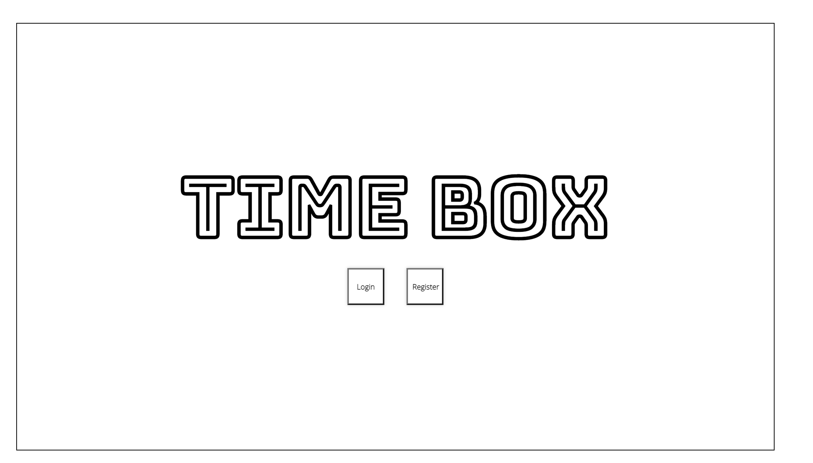
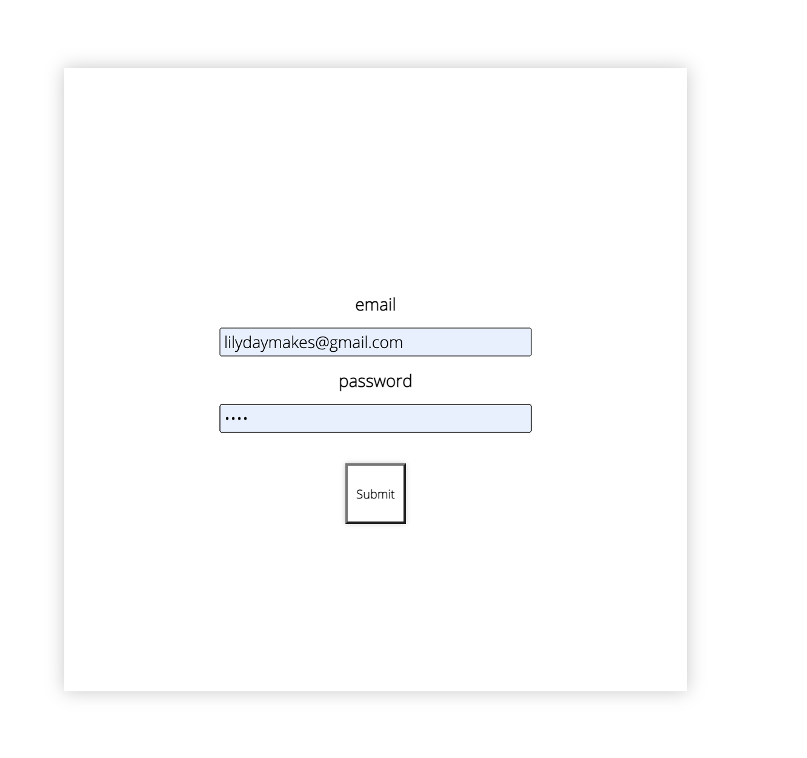
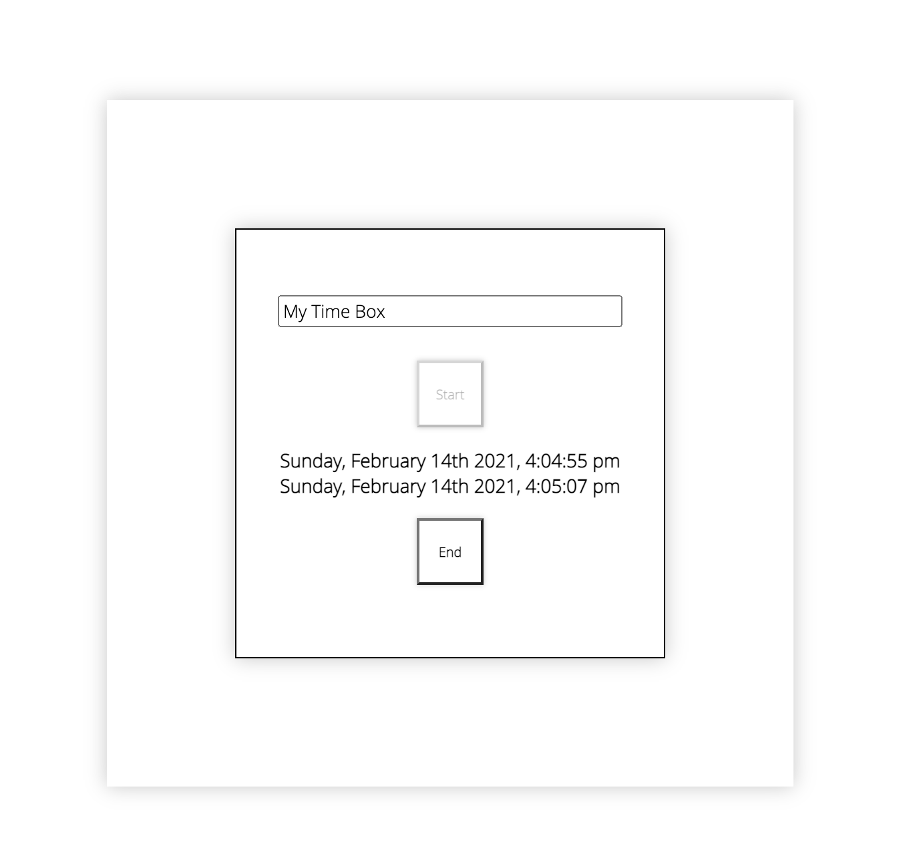
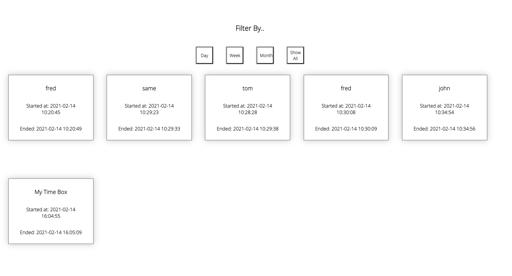
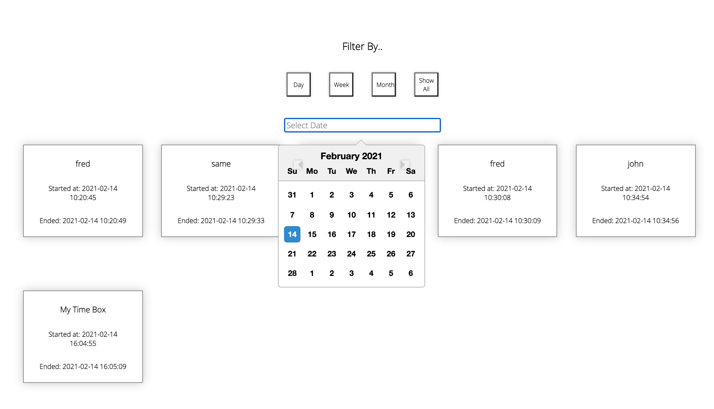

# Pento tech challenge

Thanks for taking the time to do our tech challenge. 

The challenge is to build a small full stack web app, that can help a freelancer track their time.

It should satisfy these user stories:

- As a user, I want to be able to start a time tracking session
- As a user, I want to be able to stop a time tracking session
- As a user, I want to be able to name my time tracking session
- As a user, I want to be able to save my time tracking session when I am done with it
- As a user, I want an overview of my sessions for the day, week and month
- As a user, I want to be able to close my browser and shut down my computer and still have my sessions visible to me when I power it up again.

---

## TIME BOX

Time Box has been built using a Python/Flask-SQLALchemy/React/TypeScript stack

### To Set-Up

The app does require a few things to be in place prior to running locally. We must have:

- Python3 and pipenv
- PosgreSQL (would ideally have Dockerised but this did not "smoothly" and due to time constraints, had to settle for a local db)
- Yarn

From the /back directory:
- ```pipenv run pip freeze > requirements.txt```
- ```createdb time_boxes```
- ```python seeds.py```
- ```pipenv run flask run``` 

(This should launch your back-end server running on http://127.0.0.1:5000/, if it doesn't something has gone wrong - sorry!)

From the /front directory:
- ```yarn install```
- ```yarn serve:react```

(This should launch your front end running at http://localhost:8000/)

To use the app:

1. Login or Register 


You can use the seeded user with these details if you are too lazy to register yourself:
    - email: lily@email
    - password: pass



Create your own time box by clicking start and then end. If you don't click end and leave the page, your time box will remain active. Don't worry though, you can end it later from the index page. 



Here you can see your time boxes (depending on how many you have made)



You can filter them too, select a date and a time period and you will see only time boxes from within that range. 




Technical details (though not very many):

Time boxes are created when you click 'start'. They are updated when you click 'end' (Active: TRUE ---> FALSE)

This means we don't do any actual time setting on the front-end, the time box start and and end times are just defined by the created at and updated at columns in the DB.

I chose this route to avoid potential (JS caused) inconsistencies and also just because it is nice and simple and I like that. Fewer columns and all that. 

There is of course a chance that the JavaScript generated live ticking clock that the user sees might not correspond exactly to the saved time. I think this is ok for now but I would have to consider the implications and test to see if this is noticable to the user. 


